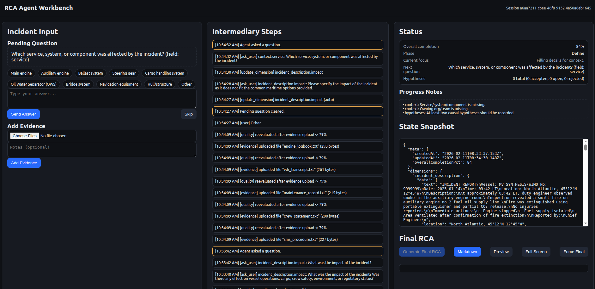

# RCA Agent Prototype (OpenAI Agents SDK - JS)



This is a **prototype** implementing the core loop based on the [RCA Agent spec](spec.md):
- shared state with **static RCA dimensions**
- **quality gates** that compute gaps + completion %
- a **single ReAct-style investigator agent** that iterates: observe → reason → act
- **ask_user** tool for targeted questions
- a final **RCA writer** agent that produces a structured RCA document from the accumulated state

> Out of scope: CAPA, review workflow, integrations.

## Prereqs
- Node.js 18+
- An OpenAI API key

## Setup
1. Install deps:
   ```bash
   npm install
   ```
2. Provide env:
   ```bash
   export OPENAI_API_KEY="sk-..."
   ```
   (Or use your process manager / .env tooling — this repo keeps it simple.)

## Run
```bash
npm run web
```

You can use generated real-life-like cases from the `synthetic` folder.

## How it works (high-level)
- You paste an incident description.
- The agent evaluates which RCA dimensions are missing.
- It asks targeted questions until mandatory dimensions are sufficiently complete (or max turns reached).
- It then generates a final RCA document with:
  - incident overview + context
  - timeline
  - evidence list + extracted “signals” (prototype-level)
  - hypotheses (accepted/rejected) with traceability notes
  - final root cause statement(s)
  - assumptions/unknowns

## Notes
- This prototype stores state in-memory only (no DB).
- Evidence processing is modeled as a tool (`add_evidence`) plus a lightweight “signal extraction” stub.
- You can replace tools with your real integrations later.
